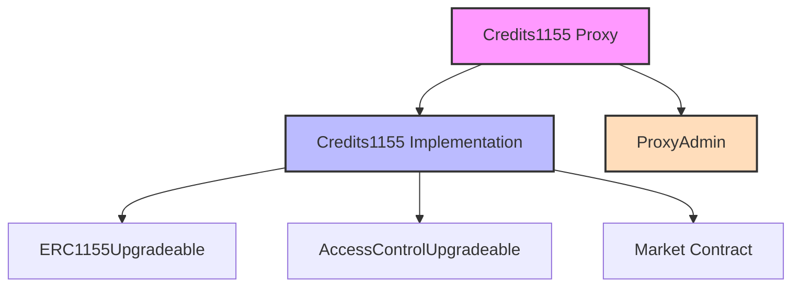

# COOP Credits Protocol

[](./LICENSE)
[](https://getfoundry.sh/)

## Overview

The COOP Credits Protocol implements a flexible and upgradeable ERC1155 token system designed for Coop Records credit management. It enables the creation, distribution, and redemption of credit tokens within the Coop Records ecosystem.

## Official Deployments

### Base Mainnet (Chain ID: 8453)

| Contract       | Address                                      | Transaction                                                                                        |
| -------------- | -------------------------------------------- | -------------------------------------------------------------------------------------------------- |
| Implementation | `0xeaa7e0a7b85ec3e78c87a622d8bf4f61c00de1dc` | [View](https://basescan.org/tx/0xdeba52a229318beaffc82d36d37641fb200af2b21df0e71f29676955d391ce35) |
| Proxy Admin    | `0xd641932fd14fef39af7458b29c968182ae3ce768` | [View](https://basescan.org/tx/0x0b976e2d3e2e07b15021760a19fef65e34b124b362075c0f238d10a7318282b4) |
| Proxy          | `0x867dd6ac7a8c0bd56f3fa028397b7693c41e14e1` | [View](https://basescan.org/tx/0x0b976e2d3e2e07b15021760a19fef65e34b124b362075c0f238d10a7318282b4) |

> **Latest Update (Aug-18-2025)**: The contract implementation has been improved to add methods for purchasing coins with credits. It also fixes a bug in our Proxy upgrades allowing the Proxy to be upgraded via the `upgradeAndCall` method on the `ProxyAdmin` contract.

### Base Sepolia (Chain ID: 84532)

| Contract       | Address                                      | Transaction                                                                                                |
| -------------- | -------------------------------------------- | ---------------------------------------------------------------------------------------------------------- |
| Implementation | `0xf079fF3347FfAEF71AD06953C229F9D5810fca28` | [View](https://sepolia.basescan.org/tx/0x9856a53ad430c54bbc703a875c96cd01f7961d1a8eefcc0d5e9a69cc7a4fd21c) |
| Proxy Admin    | `0x57c2cd477300e7ec80974b28fa55e34589627cb5` | [View](https://sepolia.basescan.org/tx/0x0af45e99179008d5efe33378867b2daa76cc2345b4e0d9011d12b305b165b3f2) |
| Proxy          | `0xB3dd782FCe60BCFBBEF1eaD56eF3a24a9c330A38` | [View](https://sepolia.basescan.org/tx/0x0af45e99179008d5efe33378867b2daa76cc2345b4e0d9011d12b305b165b3f2) |

> **Latest Update (Aug-18-2025)**: The contract implementation has been improved to add methods for purchasing coins with credits. It also fixes a bug in our Proxy upgrades allowing the Proxy to be upgraded via the `upgradeAndCall` method on the `ProxyAdmin` contract.

### Key Features

- **ERC1155 Multi-Token Standard**: Support for multiple credit types within a single contract
- **Upgradeable Architecture**: Uses OpenZeppelin's transparent proxy pattern for future improvements
- **Role-Based Access Control**: Granular permissions for minting, burning, and admin functions
- **Market Integration**: Built-in support for credit redemption through integrated market contracts
- **Gas Optimized**: Efficient implementation for cost-effective operations on L2 networks

## Protocol Architecture



The protocol uses a proxy pattern for upgradeability, with clear separation of concerns between credit management and market integration. The Credits1155 contract inherits from OpenZeppelin's battle-tested implementations while adding custom functionality for credit management.

## Getting Started

### Prerequisites

- [Foundry](https://getfoundry.sh/) - Smart contract development toolchain
- [Node.js](https://nodejs.org/) (v18 or later)
- [Git](https://git-scm.com/)

### Installation

1. Clone the repository:

```bash
git clone https://github.com/voicefirstai/CoopCreditsProtocol.git
cd CoopCreditsProtocol
```

2. Install dependencies:

```bash
# Install Foundry dependencies
forge install

# Install Node.js dependencies
pnpm install
```

3. Set up your environment:

```bash
# Copy the example environment file
cp .env.example .env

# Update .env with your configuration
# - Add your private key (from your wallet)
# - Set your market contract address
# - Configure your token URI
# - Add your Basescan API key
```

### Quick Start

1. Build the contracts:

```bash
forge build
```

## Deployment

To deploy the Credits Protocol to a network, you'll need to:

1. Configure your deployment environment in `.env` file:

2. Run the deployment script:

```bash
# Using pnpm
pnpm run deploy-credits

# Or directly with Foundry
forge clean && forge script script/Deploy.s.sol:DeployCredits --rpc-url $RPC_URL --private-key $PRIVATE_KEY --broadcast --verify --etherscan-api-key $BASESCAN_API_KEY -vvvv
```

3. After deployment, take note of the following addresses:

   - Implementation contract address
   - Proxy Admin address
   - Proxy contract address (this is the main address you'll interact with)

4. Update contract configuration (if needed):

   - Set the fixed price sale strategy (only if not provided during initialization): `cast send <PROXY_ADDRESS> "setFixedPriceSaleStrategy(address)" <STRATEGY_ADDRESS> --rpc-url $RPC_URL --private-key $PRIVATE_KEY`

5. Verify deployment by testing core functionality:
   - Buy credits: `cast send <PROXY_ADDRESS> "buyCredits(address,uint256)" <RECIPIENT_ADDRESS> <AMOUNT> --value <ETH_AMOUNT> --rpc-url $RPC_URL --private-key $PRIVATE_KEY`

## Testing

Run the test suite to verify contract functionality:

```bash
# Run all tests
forge test

# Run tests with verbosity for more detailed output
forge test -vvv

# Run a specific test file
forge test --match-path test/Credits1155.t.sol

# Run a specific test function
forge test --match-test test_BuyCredits
```

## Contract Upgrades

Since the protocol uses the transparent proxy pattern, the implementation contract can be upgraded while preserving all state:

### Using the Upgrade Script (Recommended)

The easiest way to upgrade the contract is using the provided upgrade script:

1. Configure your upgrade environment in `.env` file:

```bash
# Required for upgrades
CREDITS_PROXY_ADDRESS=<EXISTING_PROXY_ADDRESS>
CREDITS_PROXY_ADMIN=<EXISTING_PROXY_ADMIN_ADDRESS>

# Optional: Set doppler universal router for the new implementation
DOPPLER_UNIVERSAL_ROUTER=<DOPPLER_ROUTER_ADDRESS>
```

2. Run the upgrade script:

```bash
# Using pnpm
pnpm run upgrade-credits

# Or directly with Foundry
forge clean && forge script script/Upgrade.s.sol:UpgradeCredits --rpc-url $RPC_URL --private-key $PRIVATE_KEY --broadcast --verify --etherscan-api-key $BASESCAN_API_KEY -vvvv
```

The upgrade script will:

- Deploy a new `Credits1155` implementation contract
- Use the ProxyAdmin's `upgradeAndCall` method to upgrade the proxy
