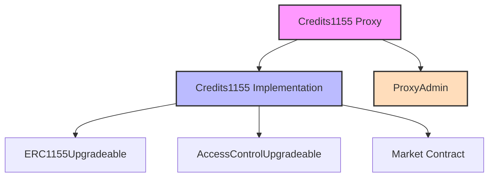

# COOP Credits Protocol

[](https://opensource.org/licenses/MIT)
[](https://github.com/voicefirstai/CoopCreditsProtocol/actions)
[](https://getfoundry.sh/)

## Overview

The COOP Credits Protocol implements a flexible and upgradeable ERC1155 token system designed for cooperative credit management. It enables the creation, distribution, and redemption of credit tokens within cooperative ecosystems.

## Official Deployments

### Base Sepolia (Chain ID: 84532)

| Contract       | Address                                      | Transaction                                                                                                |
| -------------- | -------------------------------------------- | ---------------------------------------------------------------------------------------------------------- |
| Implementation | `0x5a56fB536050Ce2eAB8172DD5e1408eE14ADDDAE` | [View](https://sepolia.basescan.org/tx/0x7b5c278ebf9b4b6882ca610b115f40fefd4a4d91aa6f5f7ce240c5ef23bf7f80) |
| Proxy Admin    | `0x6ECFBf13a69F82E278192D4F71C4E2bcAb3e239c` | [View](https://sepolia.basescan.org/tx/0xb051c7cb4ad25a4186efbb45a9f50645f80b3b2895102ee9c55837e1d552ecef) |
| Proxy          | `0x3c6238852786d1c9bcb24e12b7e36b82d55ecd3f` | [View](https://sepolia.basescan.org/tx/0x138ba0dfc661a8db9675db264d2fe6c5839cf316242788eb44e59df02105bc13) |

### Key Features

- **ERC1155 Multi-Token Standard**: Support for multiple credit types within a single contract
- **Upgradeable Architecture**: Uses OpenZeppelin's transparent proxy pattern for future improvements
- **Role-Based Access Control**: Granular permissions for minting, burning, and admin functions
- **Market Integration**: Built-in support for credit redemption through integrated market contracts
- **Gas Optimized**: Efficient implementation for cost-effective operations on L2 networks

## Protocol Architecture



The protocol uses a proxy pattern for upgradeability, with clear separation of concerns between credit management and market integration. The Credits1155 contract inherits from OpenZeppelin's battle-tested implementations while adding custom functionality for credit management.

## Getting Started

### Prerequisites

- [Foundry](https://getfoundry.sh/) - Smart contract development toolchain
- [Node.js](https://nodejs.org/) (v18 or later)
- [Git](https://git-scm.com/)

### Installation

1. Clone the repository:

```bash
git clone https://github.com/voicefirstai/CoopCreditsProtocol.git
cd CoopCreditsProtocol
```

2. Install dependencies:

```bash
# Install Foundry dependencies
forge install

# Install Node.js dependencies
pnpm install
```

3. Set up your environment:

```bash
# Copy the example environment file
cp .env.example .env

# Update .env with your configuration
# - Add your private key (from your wallet)
# - Set your market contract address
# - Configure your token URI
# - Add your Basescan API key
```

### Quick Start

1. Build the contracts:

```bash
forge build
```

2. Run the tests:

```bash
forge test
```

3. Deploy to Base Sepolia testnet:

```bash
# Make sure your wallet has Base Sepolia ETH
pnpm deploy-credits
```

### Environment Configuration

Your `.env` file should contain:

```bash
# Base Sepolia RPC URL
RPC_URL=https://sepolia.base.org

# Your deployment wallet's private key
PRIVATE_KEY=your_private_key_here

# Market contract address for initialization
MARKET_ADDRESS=your_market_contract_address

# IPFS URI for token metadata
TOKEN_URI=your_token_uri

# Basescan API Key for contract verification
BASESCAN_API_KEY=your_api_key
```

## Contract Documentation

### Credits1155 Contract

The `Credits1155` contract is an upgradeable ERC1155 implementation designed for managing cooperative credits. It extends OpenZeppelin's ERC1155Upgradeable with additional functionality for credit management and market integration.

#### Key Components

1. **Initialization**

```solidity
function initialize(string memory uri_, address payable marketAddress_)
    public
    initializer
```

- Sets up the initial contract state
- Configures token URI for metadata
- Links to the market contract
- Grants default admin role to deployer

2. **Access Control**

- `MINTER_ROLE`: Required for minting new credits
- `BURNER_ROLE`: Required for burning credits
- `DEFAULT_ADMIN_ROLE`: Can manage other roles and contract settings

3. **Core Functions**

**Minting**

```solidity
function mint(
    address to,
    uint256 id,
    uint256 amount,
    bytes memory data
) public onlyRole(MINTER_ROLE)
```

- Creates new credit tokens
- Only callable by addresses with MINTER_ROLE
- Emits TransferSingle event

**Burning**

```solidity
function burn(
    address from,
    uint256 id,
    uint256 amount
) public onlyRole(BURNER_ROLE)
```

- Destroys existing credit tokens
- Only callable by addresses with BURNER_ROLE
- Emits TransferSingle event

**Market Integration**

```solidity
function redeem(uint256 id, uint256 amount) external
```

- Allows credit redemption through the market contract
- Automatically burns credits upon successful redemption
- Requires prior approval from token holder

#### Events

1. **Standard ERC1155 Events**

- `TransferSingle`: Emitted on single token transfers
- `TransferBatch`: Emitted on batch token transfers
- `ApprovalForAll`: Emitted when approval is granted

2. **Custom Events**

- `Redeemed`: Emitted when credits are redeemed through the market

```solidity
event Redeemed(address indexed account, uint256 id, uint256 amount)
```

#### Security Considerations

1. **Access Control**

- Role-based permissions for critical functions
- Admin can manage roles but cannot directly mint/burn
- Separate roles for minting and burning

2. **Upgradeability**

- Uses transparent proxy pattern
- State variables properly initialized
- No constructor logic, all setup in initialize

3. **Integration Safety**

- Market address is immutable after initialization
- Redemption requires explicit user approval
- Protected against reentrancy attacks

#### Gas Optimization

1. **Storage Layout**

- Optimized variable packing
- Minimal storage operations
- Efficient role management

2. **Operation Batching**

- Support for batch transfers
- Batch role management
- Efficient approval mechanisms

3. **Proxy Considerations**

- Minimal proxy overhead
- Optimized delegate calls
- Efficient storage slots usage

## Foundry

**Foundry is a blazing fast, portable and modular toolkit for Ethereum application development written in Rust.**

Foundry consists of:

- **Forge**: Ethereum testing framework (like Truffle, Hardhat and DappTools).
- **Cast**: Swiss army knife for interacting with EVM smart contracts, sending transactions and getting chain data.
- **Anvil**: Local Ethereum node, akin to Ganache, Hardhat Network.
- **Chisel**: Fast, utilitarian, and verbose solidity REPL.

## Documentation

https://book.getfoundry.sh/

## Usage

### Build

```shell
$ forge build
```

### Test

```shell
$ forge test
```

### Format

```shell
$ forge fmt
```

### Gas Snapshots

```shell
$ forge snapshot
```

### Anvil

```shell
$ anvil
```

### Deploy

```shell
$ forge script script/Counter.s.sol:CounterScript --rpc-url <your_rpc_url> --private-key <your_private_key>
```

### Cast

```shell
$ cast <subcommand>
```

### Help

```shell
$ forge --help
$ anvil --help
$ cast --help
```
