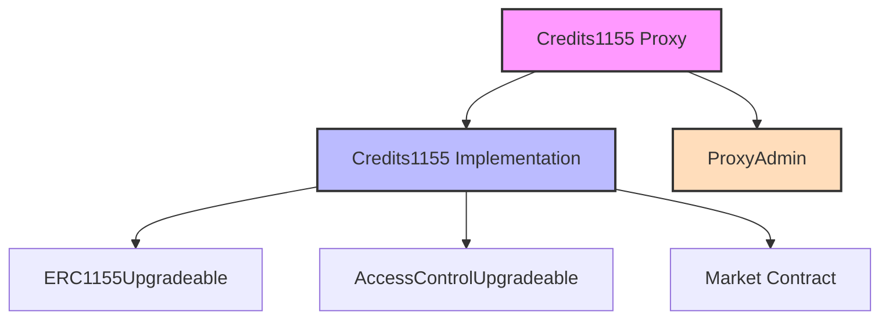

# COOP Credits Protocol

[](./LICENSE)
[](https://getfoundry.sh/)

## Overview

The COOP Credits Protocol implements a flexible and upgradeable ERC1155 token system designed for Coop Records credit management. It enables the creation, distribution, and redemption of credit tokens within the Coop Records ecosystem.

## Official Deployments

### Base Sepolia (Chain ID: 84532)

| Contract       | Address                                      | Transaction                                                                                                |
| -------------- | -------------------------------------------- | ---------------------------------------------------------------------------------------------------------- |
| Implementation | `0x976f2D1abeb7517D4e1D6748b48Db90F8aFd927F` | [View](https://sepolia.basescan.org/tx/0x0316f4ebd0a231d928fc880d7e624fed3d5280b9f6c16ac534908358a1e1357f) |
| Proxy Admin    | `0x49444dec297893751f0475B010ea09DB4132E811` | [View](https://sepolia.basescan.org/tx/0x34901f3ac1817480970a4644b59cdea5bad320d39b5b29173695fd05538c24f9) |
| Proxy          | `0xbbf57b8b9f2d63caf22430a366eea4b716fa17a3` | [View](https://sepolia.basescan.org/tx/0xe72a0877f910a08e3c6851d5ccb4791cbae4f77e7be148162656a7c5182ad005) |

### Key Features

- **ERC1155 Multi-Token Standard**: Support for multiple credit types within a single contract
- **Upgradeable Architecture**: Uses OpenZeppelin's transparent proxy pattern for future improvements
- **Role-Based Access Control**: Granular permissions for minting, burning, and admin functions
- **Market Integration**: Built-in support for credit redemption through integrated market contracts
- **Gas Optimized**: Efficient implementation for cost-effective operations on L2 networks

## Protocol Architecture



The protocol uses a proxy pattern for upgradeability, with clear separation of concerns between credit management and market integration. The Credits1155 contract inherits from OpenZeppelin's battle-tested implementations while adding custom functionality for credit management.

## Getting Started

### Prerequisites

- [Foundry](https://getfoundry.sh/) - Smart contract development toolchain
- [Node.js](https://nodejs.org/) (v18 or later)
- [Git](https://git-scm.com/)

### Installation

1. Clone the repository:

```bash
git clone https://github.com/voicefirstai/CoopCreditsProtocol.git
cd CoopCreditsProtocol
```

2. Install dependencies:

```bash
# Install Foundry dependencies
forge install

# Install Node.js dependencies
pnpm install
```

3. Set up your environment:

```bash
# Copy the example environment file
cp .env.example .env

# Update .env with your configuration
# - Add your private key (from your wallet)
# - Set your market contract address
# - Configure your token URI
# - Add your Basescan API key
```

### Quick Start

1. Build the contracts:

```bash
forge build
```

## Deployment

To deploy the Credits Protocol to a network, you'll need to:

1. Configure your deployment environment in `.env` file:

```bash
# Required environment variables
RPC_URL=           # The RPC URL of the target network (e.g., https://sepolia.base.org)
PRIVATE_KEY=       # Your wallet's private key for deployment
TOKEN_URI=         # The URI for the token metadata (e.g., ipfs://...)
BASESCAN_API_KEY=  # API key for contract verification
FIXED_PRICE_SALE_STRATEGY= # (Optional) Address of the fixed price sale strategy contract
```

2. Run the deployment script:

```bash
# Using pnpm
pnpm run deploy-credits

# Or directly with Foundry
forge clean && forge script script/Deploy.s.sol:DeployCredits --rpc-url $RPC_URL --private-key $PRIVATE_KEY --broadcast --verify --etherscan-api-key $BASESCAN_API_KEY -vvvv
```

3. After deployment, take note of the following addresses:

   - Implementation contract address
   - Proxy Admin address
   - Proxy contract address (this is the main address you'll interact with)

4. Update contract configuration (if needed):

   - Set the fixed price sale strategy (only if not provided during initialization): `cast send <PROXY_ADDRESS> "setFixedPriceSaleStrategy(address)" <STRATEGY_ADDRESS> --rpc-url $RPC_URL --private-key $PRIVATE_KEY`

5. Verify deployment by testing core functionality:
   - Buy credits: `cast send <PROXY_ADDRESS> "buyCredits(address,uint256)" <RECIPIENT_ADDRESS> <AMOUNT> --value <ETH_AMOUNT> --rpc-url $RPC_URL --private-key $PRIVATE_KEY`

## Testing

Run the test suite to verify contract functionality:

```bash
# Run all tests
forge test

# Run tests with verbosity for more detailed output
forge test -vvv

# Run a specific test file
forge test --match-path test/Credits1155.t.sol

# Run a specific test function
forge test --match-test test_BuyCredits
```

## Contract Upgrades

Since the protocol uses the transparent proxy pattern, the implementation contract can be upgraded while preserving all state:

1. Deploy a new implementation contract:

```bash
forge create src/Credits1155.sol:Credits1155 --rpc-url $RPC_URL --private-key $PRIVATE_KEY
```

2. Upgrade the proxy to point to the new implementation using the ProxyAdmin:

```bash
# Get the ProxyAdmin contract interface
cast call <PROXY_ADMIN_ADDRESS> "getProxyAdmin(address)" <PROXY_ADDRESS> --rpc-url $RPC_URL

# Upgrade the proxy to the new implementation
cast send <PROXY_ADMIN_ADDRESS> "upgrade(address,address)" <PROXY_ADDRESS> <NEW_IMPLEMENTATION_ADDRESS> --rpc-url $RPC_URL --private-key $PRIVATE_KEY
```

## License

This project is licensed under the MIT License - see the [LICENSE](LICENSE) file for details.
